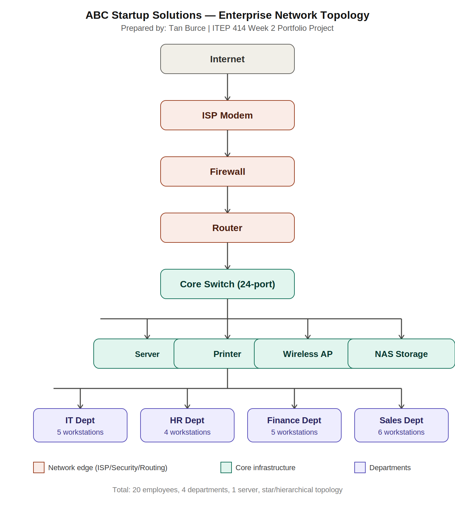

# Week 2 Portfolio Project — Enterprise Infrastructure Planning for a Startup Company

**Course:** ITEP 414 – System Administration and Maintenance
**Program:** BSIT
**Week:** 2

---

## Project Overview

This project simulates the role of a Junior System Administrator tasked with designing the complete IT infrastructure plan for ABC Startup Solutions, a newly established 20-employee software development company with no existing computers, servers, network, or security policies. The plan covers company profiling, hardware/software/network inventories, network topology design, IT role research, infrastructure recommendations, and a personal reflection.

## Learning Objectives

- Explain the roles and responsibilities of a System Administrator.
- Identify the hardware, software, and networking requirements of a small business.
- Describe the purpose of IT documentation and infrastructure planning.
- Analyze organizational IT requirements and design an enterprise network topology.
- Create professional technical documentation using Markdown.

## Company Scenario

ABC Startup Solutions is a newly established software development company with 20 employees across four departments:

| Department | Employees |
|---|---|
| Information Technology | 5 |
| Human Resources | 4 |
| Finance | 5 |
| Sales | 6 |
| **TOTAL** | **20** |

The company currently has no computers, server, network, internet infrastructure, or security policies — everything was designed from scratch as part of this project.

## Hardware Inventory Summary

11 hardware categories were planned, including 14 desktop computers, 6 laptops, 1 server, 1 router, 2 switches, 2 network printers, 3 UPS units, 2 wireless access points, 1 NAS storage unit, 2 external backup drives, and 20 monitors — sized specifically to match each department's work style (e.g., laptops for HR's interview-heavy, mobile role; desktops for Finance and most of IT). Full details and justifications are in `EnterpriseInfrastructurePlan.docx`.

## Software Inventory Summary

The software stack includes Windows 11 Pro for general workstations, Ubuntu Server 26.04 LTS for the internal server, Microsoft 365 for productivity, and a developer toolchain of VS Code, Git, GitHub Desktop, and VirtualBox for the IT department. Microsoft Defender provides baseline endpoint security, with AnyDesk for remote helpdesk support and 7-Zip for file compression. Full version, licensing, and justification details are in `EnterpriseInfrastructurePlan.docx`.

## Embedded Network Diagram

The network follows a star/hierarchical topology: Internet → ISP Modem → Firewall → Router → Core Switch, which then distributes connections to the Server, Printer, Wireless Access Point, and NAS Storage, and further out to all four department workstation groups. This design centralizes security enforcement at the firewall/router layer. Full-resolution PNG and PDF versions are available in the `diagrams/` folder.

## Technologies Used

- **VirtualBox** — referenced for future server virtualization needs
- **Ubuntu Server 26.04 LTS** — planned internal server OS
- **Draw.io-style network diagramming** — used to design the network topology
- **Markdown / GitHub** — used for professional technical documentation and version control

## Challenges Encountered

1. **Determining realistic hardware quantities.** It would have been easy to assign generic quantities, but justifying the exact split between desktops and laptops required actually reasoning through how each department works day to day (e.g., HR needing mobility for interviews vs. Finance needing fixed, secure workstations).
2. **Designing a readable network diagram.** With four departments, a server, and multiple network devices, keeping the diagram uncluttered while still showing every required component (ISP modem, firewall, router, switch, access point, server, printer, all four departments) required careful layout planning.

## Reflection

Planning the IT infrastructure for ABC Startup Solutions from scratch taught me that system administration begins long before any hardware is purchased or any server is powered on. Coming from Week 3's hands-on Ubuntu Server deployment, I expected this project to feel less technical, but I found that infrastructure planning actually requires a different kind of technical judgment — translating a business's size, departments, and goals into specific, justified hardware and software decisions rather than following a fixed installation checklist.

The most challenging task was the hardware and network inventory, specifically deciding realistic quantities. It would have been easy to simply list one of everything, but justifying why 14 desktops versus 6 laptops made sense for this particular department mix forced me to actually think about how each team works day to day — Sales and HR need mobility for meetings and interviews, while Finance and most of IT benefit from fixed, more powerful workstations. Designing the network diagram was similarly challenging, since I had to make sure every department's traffic had a logical path back to the router and firewall without the diagram becoming cluttered or unclear.

This project reinforced why planning must come before deployment: every mistake made on paper costs nothing, but the same mistake made after purchasing hardware or wiring an office is expensive and disruptive to fix. An infrastructure plan is also what allows a System Administrator to communicate technical decisions to non-technical stakeholders, like a company executive, in a way that justifies the budget being requested.

Overall, this project helped me understand that becoming a better System Administrator isn't only about knowing how to install and configure systems, but also about being able to step back, analyze a business's actual needs, and design an infrastructure that is realistic, secure, and able to grow with the company. That combination of technical knowledge and business awareness is something I now feel more confident applying to future, larger-scale infrastructure projects.

## References

- CompTIA. (2026). CompTIA Network+ certification overview. https://www.comptia.org/certifications/network
- Linux Foundation. (2026). Linux Foundation Certified System Administrator (LFCS). https://training.linuxfoundation.org/certification/linux-foundation-certified-sysadmin-lfcs/
- Coursera. (2026). 5 Linux career paths to pursue in 2026. https://www.coursera.org/articles/linux-career-path
- Amazon Web Services. (2026). AWS Certified Cloud Practitioner. https://aws.amazon.com/certification/certified-cloud-practitioner/
- Microsoft. (2026). Microsoft Certified: Azure Administrator Associate. https://learn.microsoft.com/certifications/azure-administrator/
